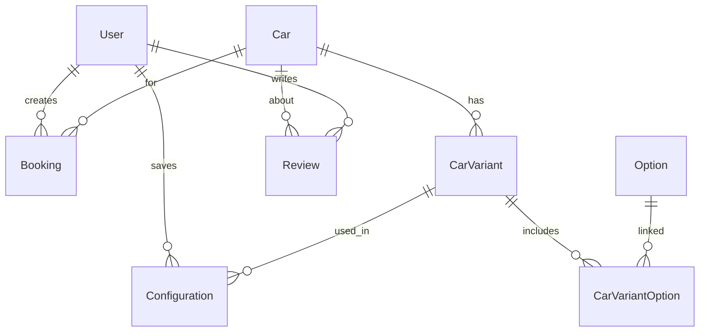

# ER-диаграмма базы данных

**СУБД:** MySQL 8  
**ORM:** Prisma

## Основные сущности



## Таблицы

| Модель | Назначение |
|--------|------------|
| `User` | Клиенты, личный кабинет |
| `Car` | Автомобили (новые / б/у / акции) |
| `CarVariant` | Комплектации |
| `Color` | Цвета кузова и салона |
| `Option` | Опции и пакеты |
| `Configuration` | Сохранённые конфигурации |
| `Booking` | Запись на ТД и ТО |
| `ServiceSlot` | Слоты расписания |
| `Review` | Отзывы клиентов |
| `BlogPost` | Статьи блога |
| `FAQ` | Частые вопросы |
| `Promotion` | Акции и спецпредложения |

## Миграции

```bash
cd backend
pnpm prisma:migrate   # prisma migrate dev
pnpm prisma:seed      # seed-данные
```
