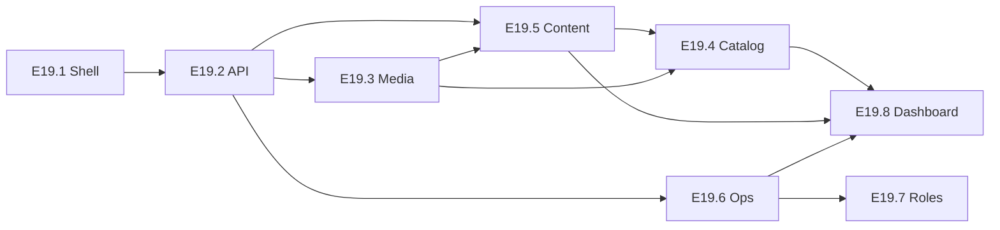

# E19 — Кастомная админка сайта (CMS + операции)

**Приоритет:** P0  
**Фаза:** 4 (параллельно E11/E12)  
**Решение:** ✅ **Вариант A** — своя Admin API + Admin UI (Next.js)  
**Оценка:** ~80–100 ч (полноценная v1)  
**Прогресс:** **100% v1** — см. [STATUS.md](../../STATUS.md)

> Закрывает **E2.3** (контент без деплоя). **Bitrix24** остаётся только для CRM-лидов (E12.1), не для CMS.

## Зачем

Контент-менеджер и менеджер дилера должны **управлять сайтом и заявками** через один понятный интерфейс — без правок кода, seed и деплоя frontend.

## Принципы UX

| Принцип | Реализация |
|---------|------------|
| Один вход | `/admin` — отдельный layout, не публичный header сайта |
| Понятная навигация | Sidebar: Dashboard → Catalog → Content → Bookings → Settings |
| Без «технического» жаргона | «Модели», «Акции», «Заявки на цену» — не slug/JSON |
| Безопасные действия | Confirm на delete, toast на save, disabled пока saving |
| Адаптив | Desktop-first; tablet usable (mobile — read-only ok) |
| Единый UI-kit | Токены Suzuki из `globals.css` + admin-компоненты |
| Быстрый feedback | Skeleton loaders, inline validation, empty states с CTA |

## Архитектура

```
/admin (Next.js App Router)
  └── AdminShell (sidebar, header, auth guard)
        ├── Dashboard
        ├── Catalog → Cars, Colors & options (phase 2)
        ├── Content → Blog, FAQ, Promotions, Pages
        ├── Operations → Bookings, Quotes, Service slots
        └── Settings → Users, Roles (admin only)

/api/admin/* (NestJS AdminModule)
  └── JwtAdminGuard + role check (admin | content-manager | dealer-manager)
        └── CRUD → Prisma (те же модели, что публичный сайт)
```

**Уже есть (переиспользуем):**

- `GET/POST/PATCH /api/bookings/admin/slots` — мигрирован на `JwtAuthGuard + AdminRolesGuard` (E19.2.5/E19.6); `AdminApiKeyGuard` удалён из кодовой базы
- Prisma: `Car`, `BlogPost`, `FAQ`, `Promotion`, `Booking`, `QuoteRequest`, `ServiceSlot`

## Эпики (подзадачи)

| ID | Название | Файл | Оценка | Статус |
|----|----------|------|--------|--------|
| E19.1 | Основа: auth, layout, design system | [E19.1-admin-shell.md](./E19.1-admin-shell.md) | ~12 ч | ✅ |
| E19.2 | Admin API: модуль, guards, Swagger | [E19.2-admin-api.md](./E19.2-admin-api.md) | ~10 ч | ✅ |
| E19.3 | Медиа: загрузка и библиотека | [E19.3-media-library.md](./E19.3-media-library.md) | ~10 ч | ✅ |
| E19.4 | Каталог: модели и комплектации | [E19.4-catalog-cars.md](./E19.4-catalog-cars.md) | ~24 ч | ✅ (MVP; variants/colors/options — v1.1) |
| E19.5 | Контент: блог, FAQ, акции, страницы | [E19.5-content-cms.md](./E19.5-content-cms.md) | ~16 ч | ✅ |
| E19.6 | Операции: брони, quotes, слоты | [E19.6-operations.md](./E19.6-operations.md) | ~14 ч | ✅ |
| E19.7 | Роли, пользователи, audit | [E19.7-roles-users.md](./E19.7-roles-users.md) | ~8 ч | ✅ (audit — later) |
| E19.8 | Dashboard, polish, QA | [E19.8-dashboard-qa.md](./E19.8-dashboard-qa.md) | ~8 ч | ✅ |

## Порядок реализации (рекомендуемый)



1. **Sprint 1 (MVP admin):** E19.1 → E19.2 → E19.5 (FAQ + Promotions + Blog) — контент без деплоя
2. **Sprint 2:** E19.3 Media → E19.6 Operations (quotes inbox, slots UI, bookings list)
3. **Sprint 3:** E19.4 Catalog (cars — самый тяжёлый блок)
4. **Sprint 4:** E19.7 Roles → E19.8 Dashboard + UAT

## DoD эпика E19 (v1)

- [x] Вход в `/admin` только для staff-ролей
- [x] CRUD: FAQ, Promotions, Blog (publish/unpublish)
- [x] CRUD: Car — базовые поля + цена + «в наличии» / offer flag
- [x] Медиа: upload + выбор картинки в формах
- [x] Операции: список броней, quote-заявок; UI слотов (вместо Postman)
- [x] Изменения видны на публичном сайте без redeploy
- [x] Swagger: `/api/admin/*` задокументирован
- [x] Smoke: admin login + create FAQ + видно на сайте
- [x] Роли: content / dealer ограничения + staff users list
- [x] Dashboard widgets + `docs/admin-user-guide.md`

## Вне scope v1 (v2 / post-MVP)

- Полный редактор 360° assets и configurator options tree в UI
- WYSIWYG page builder для всех landing-блоков
- i18n полей в админке (→ E14)
- Review moderation UI (→ E9)
- Strapi / внешняя CMS

## Связи

| Эпик | Связь |
|------|-------|
| E2.3 | ✅ Закрывается через E19 |
| E12.1 Bitrix24 | Параллельно — только leads, не контент |
| E2.2.4 | Публичные Blog/FAQ API — частично из E19.5 |
| E6.1 | Service slots — UI в E19.6 |
